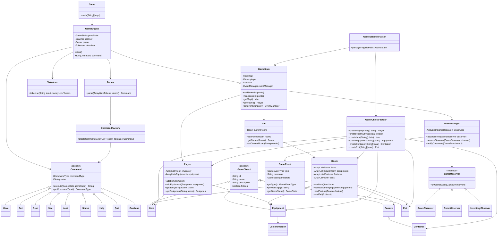

# Zork Text-Based Game Engine

## Project Overview

This project refactors a Zork-style text-based adventure game into a reusable text-based game engine.

The original game structure was mainly focused on running one specific adventure game. This version improves the software architecture by separating the game loop, command handling, object creation, and event notification logic into independent components.

The main aim of this project is to demonstrate object-oriented programming principles and design patterns in a text-based game system.

---

## Main Features

- Text-based player input system
- Room-based map navigation
- Item collection and dropping
- Equipment usage
- Player inventory and status display
- Score tracking
- Game state loading from a text file
- Extensible command system
- Event notification system based on the Observer Pattern
- Object creation system based on the Factory Pattern

---

## Object-Oriented Design

This project applies the following object-oriented programming principles.

### Encapsulation

Game objects such as `Room`, `Player`, `Item`, `Equipment`, and `Exit` store their own data and provide methods to access or modify that data.

### Inheritance

Different game objects inherit from shared parent classes. For example, `Item`, `Equipment`, `Feature`, and `Exit` are all specialised game objects.

### Polymorphism

All commands inherit from the abstract `Command` class. Each command provides its own implementation of the `execute(GameState gameState)` method.

### Abstraction

The `Command` class defines the general structure of a command, while concrete command classes such as `Move`, `Get`, `Drop`, and `Use` provide the detailed behaviour.

---

## Design Patterns Used

## 1. Command Pattern

The Command Pattern is used to represent each player action as a command object.

For example:

- `Move`
- `Get`
- `Drop`
- `Use`
- `Look`
- `Status`
- `Help`
- `Quit`
- `Combine`

Each command extends the abstract `Command` class and implements its own `execute()` method.

This design makes the command system easier to extend. To add a new command, a new command class can be created without changing the main game loop.

### Command Pattern Structure

```text
User Input
    ↓
Tokeniser
    ↓
Parser
    ↓
CommandFactory
    ↓
Command Object
    ↓
execute(GameState)
```

---

## 2. Factory Pattern

The Factory Pattern is used to centralise object creation.

This project uses two factory-style components:

### CommandFactory

`CommandFactory` creates command objects based on tokens produced by the parser.

For example, when the player enters:

```text
move north
```

The parser passes the tokens to `CommandFactory`, and the factory creates a `Move` command object.

### GameObjectFactory

`GameObjectFactory` creates game objects such as:

- `Player`
- `Room`
- `Item`
- `Equipment`
- `Container`
- `Exit`
- `UseInformation`

Previously, `GameStateFileParser` directly created these objects. After refactoring, `GameStateFileParser` only reads and organises data, while `GameObjectFactory` handles object construction.

This reduces coupling between the file parser and the concrete game object classes.

---

## 3. Observer Pattern

The Observer Pattern is used to react to game state changes.

The project defines:

- `GameEvent`
- `GameEventType`
- `GameObserver`
- `EventManager`
- `ScoreObserver`
- `RoomObserver`
- `InventoryObserver`

When an important action happens, a `GameEvent` is created and sent through the `EventManager`.

Examples of observable events include:

- Player moves to another room
- Player picks up an item
- Player drops an item
- Player uses equipment
- Player score changes
- Player quits the game

This makes the system more extensible. New behaviours such as logging, achievement tracking, or automatic hints can be added by creating new observers without rewriting the command classes.

---

## System Architecture

The project is divided into several layers.

```text
Application Layer
    Game.java

Engine Layer
    GameEngine.java

Command Layer
    Command.java
    Move.java
    Get.java
    Drop.java
    Use.java
    Look.java
    Status.java
    Help.java
    Quit.java
    Combine.java
    CommandFactory.java

Parser Layer
    Parser.java
    Tokeniser.java
    Token.java
    TokenType.java

Factory Layer
    GameObjectFactory.java

Event Layer
    GameEvent.java
    GameEventType.java
    GameObserver.java
    EventManager.java
    ScoreObserver.java
    RoomObserver.java
    InventoryObserver.java

Game Object Layer
    GameState.java
    Map.java
    Room.java
    Player.java
    Item.java
    Equipment.java
    Feature.java
    Container.java
    Exit.java
    UseInformation.java

Utility Layer
    GameStateFileParser.java
```

---

## UML Class Diagram



---

## How to Run

Compile the project:

```sh
javac -d out \
src/org/uob/a2/*.java \
src/org/uob/a2/engine/*.java \
src/org/uob/a2/commands/*.java \
src/org/uob/a2/events/*.java \
src/org/uob/a2/factory/*.java \
src/org/uob/a2/gameobjects/*.java \
src/org/uob/a2/parser/*.java \
src/org/uob/a2/utils/*.java
```

Run the game:

```sh
java -cp out org.uob.a2.Game
```

---

## Example Commands

```text
look
look room
look exits
status
move north
get key
drop key
use key on door
combine item1 item2
help
quit
```

---

## Extending the Engine

### Adding a New Command

To add a new command:

1. Create a new class that extends `Command`.
2. Add a new value to `CommandType`.
3. Add token recognition in `Tokeniser`.
4. Add creation logic in `CommandFactory`.

For example, to add an `Attack` command, a new `Attack` class can be created and registered in the command factory.

### Adding a New Game Object

To add a new type of game object:

1. Create a new class that extends `GameObject` or one of its subclasses.
2. Add object creation logic in `GameObjectFactory`.
3. Add parsing logic in `GameStateFileParser`.
4. Add the object data to the game data file.

### Adding a New Observer

To add a new observer:

1. Create a class that implements `GameObserver`.
2. Implement the `onGameEvent(GameEvent event)` method.
3. Register the observer in `GameEngine`.

For example, a `LoggingObserver` could be added to record all game events.

---

## Benefits of the Refactored Design

This refactored design improves the project in several ways.

### High Cohesion

Each class has a clear responsibility.

For example, `GameEngine` controls the game loop, `CommandFactory` creates commands, and `GameObjectFactory` creates game objects.

### Low Coupling

Classes depend less directly on concrete implementations.

For example, `Parser` no longer directly creates every command class. It delegates command creation to `CommandFactory`.

### Extensibility

New commands, new game objects, and new event responses can be added with limited changes to existing code.

### Maintainability

The project structure is easier to understand, test, and modify because the responsibilities are separated clearly.

---

## Conclusion

This project demonstrates how a simple text-based adventure game can be improved using object-oriented design principles and design patterns.

The Command Pattern is used for player actions, the Factory Pattern is used for object creation, and the Observer Pattern is used for game event notification. Together, these patterns make the game engine more modular, reusable, and extensible.